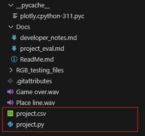

# Installation Guide:
You must import the tkinter, customtkinter, pandas and matplotlib modules. Do this using py -m pip install _______ in windows powershell. You must ensure that
the project.csv file is in the same file path as the project.py file. You must also ensure all the requirements are installed by going to the VS code terminal and typing in py -m pip install -r requirements.text


```bash
py -m pip install tkinter
py -m pip install customtkinter
py -m pip install pandas
py -m pip install matplotlib
```
```bash
py -m pip install -r requirements.txt
```

## On startup:
The application should begin with no pre-installed subjects, but if there are you may delete them as you wish. To add a new subject, simply press the 'Add Subject' button, and add the subject you would like. For more help visit the 'Instructions' page.
If there appears to be a visual glitch or the program is not running as intended, close the application and restart the program.

